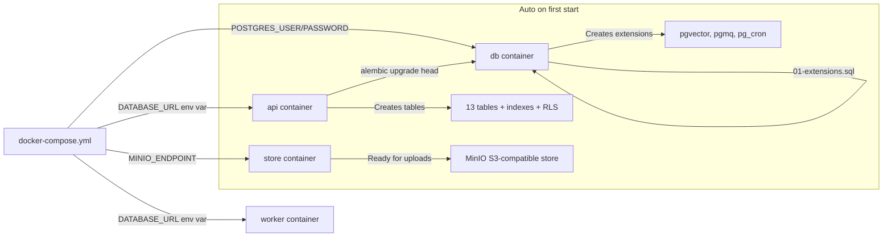

# fin-rag — Startup & Admin Setup Guide

Step-by-step guide to go from zero to a running platform with your first admin account.

---

## Prerequisites

You need these installed on your machine:

| Tool | Version | Check command |
|------|---------|---------------|
| **Docker Desktop** | ≥ 4.x | `docker --version` |
| **Docker Compose** | ≥ 2.x (included in Docker Desktop) | `docker compose version` |
| **Git** | any | `git --version` |

> [!NOTE]
> On Windows, make sure Docker Desktop is **running** (whale icon in system tray) before proceeding.

---

## Step 1: Create the `.env` file

The `.env` file holds all secrets and configuration. **Never commit this file.**

```powershell
# From the project root:
cd c:\Users\vaddi\Downloads\supportdesk_openenv\fin-rag\infra

# Copy the template
copy .env.example .env
```

Now open `infra\.env` in your editor and fill in these **required** values:

### Passwords (change these!)

```env
# Pick strong passwords — these secure your database and object store
POSTGRES_USER=finrag
POSTGRES_PASSWORD=MyStr0ngP@ss2026!
POSTGRES_DB=finrag

MINIO_ROOT_USER=finrag
MINIO_ROOT_PASSWORD=MyM1ni0P@ss2026!
```

### JWT Secret (generate a random one)

```powershell
# In PowerShell, generate a random secret:
[Convert]::ToBase64String((1..48 | ForEach-Object { Get-Random -Maximum 256 }) -as [byte[]])
```

Paste the output into `.env`:
```env
JWT_SECRET=<paste-your-random-base64-string-here>
JWT_TTL_HOURS=24
```

### LLM Provider (pick ONE)

````carousel
**Option A: OpenAI (easiest, recommended for pilot)**
```env
LLM_PROVIDER=openai
LLM_BASE_URL=https://api.openai.com/v1
LLM_API_KEY=sk-proj-your-actual-openai-key
LLM_MODEL=gpt-4o-mini
```
<!-- slide -->
**Option B: OpenRouter (cheap, many models)**
```env
LLM_PROVIDER=openai
LLM_BASE_URL=https://openrouter.ai/api/v1
LLM_API_KEY=sk-or-your-openrouter-key
LLM_MODEL=meta-llama/llama-3.1-70b-instruct
```
<!-- slide -->
**Option C: Ollama (free, runs locally, no API key needed)**

First install & run Ollama on your host machine:
```powershell
# Install from https://ollama.ai, then:
ollama pull llama3.1:8b-instruct
ollama serve
```

Then in `.env`:
```env
LLM_PROVIDER=openai
LLM_BASE_URL=http://host.docker.internal:11434/v1
LLM_API_KEY=ollama
LLM_MODEL=llama3.1:8b-instruct
```
<!-- slide -->
**Option D: vLLM on GPU (requires NVIDIA ≥12GB VRAM)**
```env
LLM_PROVIDER=local
LLM_BASE_URL=http://llm:8001/v1
LLM_API_KEY=EMPTY
LLM_MODEL=mistral-7b-instruct
VLLM_MODEL=mistralai/Mistral-7B-Instruct-v0.2
HUGGING_FACE_HUB_TOKEN=hf_your_token
```
Use `make up-local` instead of `make up` in Step 2.
````

### Leave these as-is (defaults are correct)

```env
APP_PORT=3000
API_PORT=8000
POSTGRES_PORT=5432
MINIO_PORT=9000
MINIO_CONSOLE_PORT=9001
GRAFANA_PORT=3001
PROMETHEUS_PORT=9090
EMBED_MODEL=BAAI/bge-base-en-v1.5
RERANKER_MODEL=cross-encoder/ms-marco-MiniLM-L-6-v2
NEXT_PUBLIC_API_BASE_URL=http://localhost:8000
NEXT_PUBLIC_GRAFANA_BASE_URL=http://localhost:3001
GRAFANA_USER=admin
GRAFANA_PASSWORD=admin
LOG_LEVEL=INFO
CORS_ORIGINS=["http://localhost:3000"]
```

---

## Step 2: Build & Start the Stack

```powershell
# From the project root:
cd c:\Users\vaddi\Downloads\supportdesk_openenv\fin-rag

# Build all Docker images (first time takes 5-10 minutes)
docker compose -f infra/docker-compose.yml --env-file infra/.env build

# Start everything
docker compose -f infra/docker-compose.yml --env-file infra/.env up -d
```

Or if you have `make` installed:
```powershell
make build
make up
```

> [!IMPORTANT]
> The first build downloads ~3GB of Docker images and Python packages. On slow connections, this can take 15-20 minutes. Subsequent starts are instant.

---

## Step 3: Verify All Services Are Running

```powershell
docker compose -f infra/docker-compose.yml --env-file infra/.env ps
```

You should see **6 services** (7 if using vLLM):

```
NAME         STATUS          PORTS
db           Up (healthy)    0.0.0.0:5432->5432/tcp
store        Up (healthy)    0.0.0.0:9000->9000/tcp, 0.0.0.0:9001->9001/tcp
api          Up (healthy)    0.0.0.0:8000->8000/tcp
worker       Up              0.0.0.0:9100->9100/tcp
app          Up              0.0.0.0:3000->3000/tcp
prometheus   Up              0.0.0.0:9090->9090/tcp
obs          Up              0.0.0.0:3001->3000/tcp
```

> [!WARNING]
> If `api` shows `Up (health: starting)`, wait 30 seconds and check again. The API runs `alembic upgrade head` on first startup to create all database tables — this takes a moment.

### Check API health:
```powershell
curl http://localhost:8000/health
```
Expected: `{"status":"ok"}`

---

## What Happened Automatically

When the stack starts, **all database connections are automatic** — you don't configure them manually:



| What | How it connects | Configured where |
|------|-----------------|-----------------|
| **PostgreSQL** | `postgresql+psycopg://finrag:PASSWORD@db:5432/finrag` | `DATABASE_URL` env in docker-compose |
| **Extensions** | Auto-created by `infra/postgres/init/01-extensions.sql` | Mounted as init script |
| **Tables** | Auto-created by `alembic upgrade head` on API startup | API Dockerfile CMD |
| **MinIO** | `store:9000` (Docker internal DNS) | `MINIO_ENDPOINT` env |
| **Worker ↔ API** | `http://worker:9100` (Docker internal DNS) | `WORKER_URL` env |
| **Prometheus** | Scrapes `api:8000/metrics` + `worker:9100/metrics` | `infra/prometheus.yml` |
| **Grafana** | Reads from Prometheus datasource | `infra/grafana/provisioning/` |

---

## Step 4: Create the Admin Invite Key

Now the critical step — generating your first admin account:

```powershell
# Shell into the running API container:
docker compose -f infra/docker-compose.yml --env-file infra/.env exec api bash
```

You're now inside the container at `/app`. Run:

```bash
python -m scripts.bootstrap_admin --project "My Company"
```

> [!TIP]
> Replace `"My Company"` with your actual company/project name. This creates the project namespace.

**Output:**
```
============================================================
Project   : My Company
Project ID: a1b2c3d4-e5f6-7890-abcd-ef1234567890
Role      : admin
Invite key: finrag_xY9kAb3mNpQ7rS2tUvWxYz...
Expires   : in 24h, max_uses=1
============================================================
Sign up at /signup with this key to become the project admin.
```

> [!CAUTION]
> **Copy the invite key NOW!** It is shown only once. The database stores only the bcrypt hash — the raw key cannot be recovered.

Exit the container:
```bash
exit
```

### Optional: Custom TTL and uses

```bash
# Key valid for 7 days, usable by 5 people:
python -m scripts.bootstrap_admin --project "My Company" --ttl-hours 168 --max-uses 5
```

---

## Step 5: Sign Up as Admin

1. Open your browser: **http://localhost:3000/signup**

2. Fill in:
   - **Email**: your email address
   - **Password**: minimum 8 characters
   - **Display name**: your name (optional)
   - **Invite key**: paste the key from Step 4

3. Click **Create account**

4. You're now logged in as **admin** and redirected to the chat page.

5. Click **Admin** in the top nav → you'll see the full admin control center.

---

## Step 6: Verify Everything Works

### Check the Admin Dashboard
Navigate to **http://localhost:3000/admin** — you should see:
- Overview with stats (all zeros initially)
- Sidebar with all 11 admin pages

### Upload a test document
1. Go to **Admin → Sources**
2. Click **Upload file**
3. Pick a PDF, DOCX, XLSX, or any supported file
4. Watch the state progress: `pending → approved → extracting → extracted → chunked → embedded`

### Ask a question
1. Go to **Chat** (click "Chat" in top nav or go to `/`)
2. Type a question about the document you just uploaded
3. You should get an answer with citations

### Check the services directly

| Service | URL | What to see |
|---------|-----|-------------|
| **App (UI)** | http://localhost:3000 | Chat interface |
| **API** | http://localhost:8000/docs | Swagger API docs |
| **MinIO Console** | http://localhost:9001 | Object storage browser (login: your MINIO credentials) |
| **Grafana** | http://localhost:3001 | Metrics dashboards (login: admin/admin) |
| **Prometheus** | http://localhost:9090 | Raw metrics |

---

## Common Commands

```powershell
# View logs (all services)
docker compose -f infra/docker-compose.yml --env-file infra/.env logs -f --tail=100

# View logs (specific service)
docker compose -f infra/docker-compose.yml --env-file infra/.env logs -f api
docker compose -f infra/docker-compose.yml --env-file infra/.env logs -f worker
docker compose -f infra/docker-compose.yml --env-file infra/.env logs -f db

# Stop everything
docker compose -f infra/docker-compose.yml --env-file infra/.env down

# Stop and DELETE all data (fresh start)
docker compose -f infra/docker-compose.yml --env-file infra/.env down -v

# Restart a single service
docker compose -f infra/docker-compose.yml --env-file infra/.env restart api

# Open a psql shell to the database
docker compose -f infra/docker-compose.yml --env-file infra/.env exec db psql -U finrag -d finrag

# Run database migrations manually
docker compose -f infra/docker-compose.yml --env-file infra/.env exec api alembic upgrade head

# Shell into API container (for debugging)
docker compose -f infra/docker-compose.yml --env-file infra/.env exec api bash

# Shell into worker container
docker compose -f infra/docker-compose.yml --env-file infra/.env exec worker bash
```

Or with `make` (shorter):
```powershell
make up          # start
make down        # stop
make logs        # tail logs
make psql        # database shell
make migrate     # run migrations
make shell-api   # bash into API
make shell-db    # bash into DB
```

---

## Troubleshooting

### `api` container keeps restarting
```powershell
docker compose -f infra/docker-compose.yml --env-file infra/.env logs api
```
- **"FATAL: password authentication failed"** → Your `POSTGRES_PASSWORD` in `.env` doesn't match. If you changed it after first start, you need to delete the volume: `docker compose ... down -v` and start fresh.
- **"Connection refused"** → The `db` container isn't ready yet. Wait 30 seconds.

### `worker` container crashes with CUDA error
The worker tries to use GPU if available. If you don't have an NVIDIA GPU, it falls back to CPU. If it crashes:
```powershell
docker compose -f infra/docker-compose.yml --env-file infra/.env logs worker
```
This is usually fine — it should auto-recover and use CPU.

### "invalid or exhausted invite key" on signup
- The key expired (default 24h) → generate a new one
- The key was already used (default max_uses=1) → generate a new one
- You mistyped the key → copy-paste carefully, include the `finrag_` prefix

### Port conflicts
If port 5432, 8000, 3000, etc. are already in use:
```env
# In infra/.env, change the ports:
APP_PORT=3100
API_PORT=8100
POSTGRES_PORT=5433
```

### Fresh start (nuclear option)
```powershell
docker compose -f infra/docker-compose.yml --env-file infra/.env down -v
docker compose -f infra/docker-compose.yml --env-file infra/.env up -d
# Wait for healthy, then re-create admin key
```

---

## Architecture: What's Running

```
┌─────────────────────────────────────────────────────────────┐
│                    Your Browser                             │
│   localhost:3000  →  Chat, Signup, Login, Admin Console     │
└────────────┬────────────────────────────────────────────────┘
             │ HTTP (Bearer JWT)
┌────────────▼────────────────────────────────────────────────┐
│  app (Next.js)        :3000                                 │
│  Static pages + client-side API calls                       │
└────────────┬────────────────────────────────────────────────┘
             │
┌────────────▼────────────────────────────────────────────────┐
│  api (FastAPI)        :8000                                 │
│  Auth, Query, Ingest, Admin                                 │
│  ├── PostgreSQL (db:5432)    ← tables, chunks, embeddings   │
│  ├── MinIO (store:9000)      ← raw uploaded files           │
│  └── Worker (worker:9100)    ← embed/rerank HTTP calls      │
└────────────┬────────────────────────────────────────────────┘
             │
┌────────────▼────────────────────────────────────────────────┐
│  worker               :9100                                 │
│  Embedding (BAAI/bge-base-en-v1.5)                          │
│  Reranking (ms-marco-MiniLM-L-6-v2)                         │
│  PDF/DOCX/XLSX extraction                                   │
│  PGMQ queue poller                                          │
├─────────────────────────────────────────────────────────────┤
│  db (PostgreSQL)      :5432                                 │
│  pgvector + PGMQ + pg_cron                                  │
│  13 tables, RLS policies, IVFFlat + GIN indexes             │
├─────────────────────────────────────────────────────────────┤
│  store (MinIO)        :9000 / console :9001                 │
│  S3-compatible object storage for raw files                 │
├─────────────────────────────────────────────────────────────┤
│  prometheus           :9090  →  obs (Grafana)  :3001        │
│  Metrics scraping          →  Dashboards                    │
└─────────────────────────────────────────────────────────────┘
```
